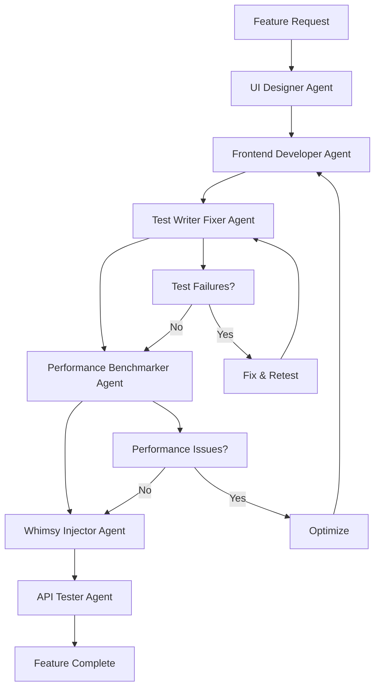
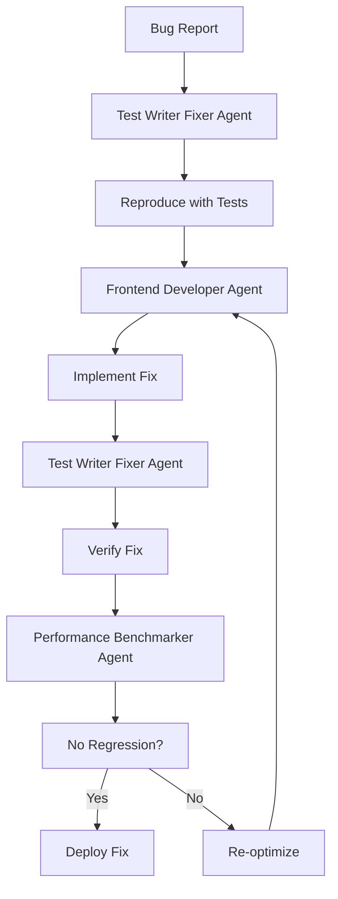
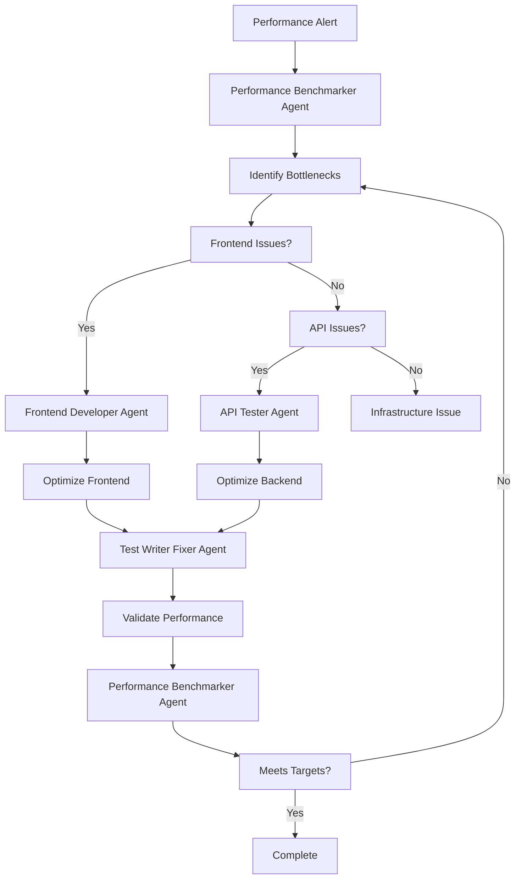

# Agent Workflow & Integration Guide

## Agent Orchestration for 6-Day Sprints

This guide establishes how specialized agents work together to deliver high-quality software within rapid development cycles.

## Core Agent Responsibilities

### Primary Development Agents

#### 1. Frontend Developer Agent
**Trigger Conditions:**
- UI/UX implementation requests
- Component development needs
- Performance optimization requirements
- Responsive design issues
- State management complexity

**Workflow Integration:**
```
User Request → Frontend Developer → UI Designer → Whimsy Injector → Test Writer Fixer
```

**Key Responsibilities:**
- React/Vue/Angular component implementation
- Performance optimization (Core Web Vitals)
- Mobile-first responsive design
- Accessibility compliance (WCAG 2.1 AA)
- State management architecture

#### 2. UI Designer Agent  
**Trigger Conditions:**
- New feature design requirements
- Design system creation/updates
- Visual hierarchy problems
- Brand inconsistency issues
- User experience improvements

**Workflow Integration:**
```
Design Request → UI Designer → Frontend Developer → Whimsy Injector → Performance Benchmarker
```

**Key Responsibilities:**
- Modern design system creation
- Figma to code implementation
- Visual hierarchy and typography
- Color systems and branding
- Mobile-first design patterns

#### 3. Test Writer Fixer Agent
**Trigger Conditions:**
- Code changes made (automatic)
- Test failures detected
- New feature implementation
- Bug fixes applied
- Refactoring completed

**Workflow Integration:**
```
Code Change → Test Writer Fixer → Performance Benchmarker → API Tester (if needed)
```

**Key Responsibilities:**
- TDD implementation
- Test coverage maintenance
- Edge case identification
- Test automation setup
- Regression prevention

## Quality Assurance Agents

#### 4. Performance Benchmarker Agent
**Trigger Conditions:**
- After major code changes
- Before deployment
- Performance regression alerts
- Load testing requests
- Optimization needs

**Workflow Integration:**
```
Performance Issue → Performance Benchmarker → Frontend Developer → Test Writer Fixer
```

**Key Responsibilities:**
- Core Web Vitals monitoring
- Bundle size optimization
- Database query performance
- Mobile device testing
- Load testing execution

#### 5. API Tester Agent
**Trigger Conditions:**
- API endpoint changes
- Integration testing needs
- Load testing requirements
- Contract validation
- Security testing

**Workflow Integration:**
```
API Change → API Tester → Performance Benchmarker → Test Writer Fixer
```

**Key Responsibilities:**
- Contract testing
- Load testing (1000+ concurrent users)
- Security vulnerability scanning
- Performance profiling
- Integration validation

## Experience Enhancement Agent

#### 6. Whimsy Injector Agent
**Trigger Conditions:**
- After UI implementation
- Error state creation
- Loading state implementation
- User achievement points
- Empty state design

**Workflow Integration:**
```
UI Complete → Whimsy Injector → Performance Benchmarker → Test Writer Fixer
```

**Key Responsibilities:**
- Micro-interactions and animations
- Delightful user experiences
- Shareable moments creation
- Error state personality
- Loading state entertainment

## Agent Coordination Workflows

### New Feature Development Workflow



### Bug Fix Workflow



### Performance Optimization Workflow



## Daily Agent Usage Patterns

### Day 1-2: Foundation Phase
```yaml
Primary Agents:
  - UI Designer: Design system setup
  - Frontend Developer: Project structure
  - Test Writer Fixer: Test framework setup

Secondary Agents:
  - Performance Benchmarker: Baseline establishment
```

### Day 3-4: Development Phase
```yaml
Primary Agents:
  - Frontend Developer: Feature implementation
  - Test Writer Fixer: TDD cycle
  - UI Designer: Component refinement

Secondary Agents:
  - Whimsy Injector: UX enhancement
  - API Tester: Integration testing
```

### Day 5-6: Polish Phase
```yaml
Primary Agents:
  - Performance Benchmarker: Optimization
  - Test Writer Fixer: Edge cases
  - Whimsy Injector: Delight features

Secondary Agents:
  - API Tester: Load testing
  - UI Designer: Final polish
```

## Agent Communication Patterns

### Inter-Agent Data Flow

#### Design to Implementation
```javascript
// UI Designer → Frontend Developer
const designTokens = {
  colors: { primary: '#3B82F6', secondary: '#8B5CF6' },
  spacing: { xs: '4px', sm: '8px', md: '16px', lg: '24px' },
  typography: { scale: [12, 14, 16, 18, 20, 24] },
  borderRadius: { sm: '4px', md: '8px', lg: '16px' }
};

// Frontend Developer → Test Writer Fixer
const componentSpec = {
  name: 'PrimaryButton',
  props: { variant, size, disabled, loading },
  states: ['default', 'hover', 'focus', 'active', 'disabled'],
  accessibility: { role: 'button', 'aria-label': 'required' }
};
```

#### Performance to Optimization
```javascript
// Performance Benchmarker → Frontend Developer
const performanceReport = {
  metrics: {
    lcp: 2.8, // Target: <2.5s
    fid: 120, // Target: <100ms
    cls: 0.15  // Target: <0.1
  },
  recommendations: [
    'Lazy load below-fold images',
    'Reduce JavaScript bundle size',
    'Implement code splitting'
  ],
  priority: 'high'
};
```

#### Testing to Development
```javascript
// Test Writer Fixer → Frontend Developer
const testResults = {
  coverage: { statements: 85, branches: 78, functions: 92 },
  failures: [
    { test: 'user login flow', error: 'timeout on slow connection' }
  ],
  edgeCases: [
    'empty form submission',
    'invalid email format',
    'network disconnection'
  ]
};
```

## Agent Automation Rules

### Automatic Agent Triggering

#### Code Change Detection
```javascript
// Auto-trigger agents on file changes
const watchRules = {
  'src/components/**/*.{js,jsx,ts,tsx}': ['test-writer-fixer', 'whimsy-injector'],
  'src/styles/**/*.{css,scss}': ['ui-designer', 'performance-benchmarker'],
  'src/api/**/*.{js,ts}': ['api-tester', 'test-writer-fixer'],
  'public/**/*': ['performance-benchmarker'],
  'package*.json': ['performance-benchmarker', 'test-writer-fixer']
};
```

#### Performance Threshold Triggers
```javascript
const performanceTriggers = {
  lcp: {
    warning: 2.5,    // Trigger performance-benchmarker
    critical: 4.0    // Trigger performance-benchmarker + frontend-developer
  },
  bundleSize: {
    warning: 200,    // KB - Trigger frontend-developer
    critical: 300    // KB - Trigger performance-benchmarker
  },
  testCoverage: {
    minimum: 80      // % - Trigger test-writer-fixer
  }
};
```

### Agent Priority System

#### High Priority Triggers (Immediate)
- Test failures
- Performance regressions
- Security vulnerabilities
- Build failures
- Critical accessibility issues

#### Medium Priority Triggers (Within Sprint)
- UI inconsistencies
- Missing test coverage
- Performance optimization opportunities
- UX enhancement opportunities

#### Low Priority Triggers (Next Sprint)
- Code refactoring opportunities
- Design system improvements
- Advanced feature implementations

## Quality Gates & Agent Checkpoints

### Pre-Commit Checks
```yaml
Required Agents:
  - test-writer-fixer: All tests passing
  - performance-benchmarker: No performance regression
  - ui-designer: Design system compliance

Optional Agents:
  - whimsy-injector: UX enhancement audit
```

### Pre-Deployment Checks
```yaml
Required Agents:
  - test-writer-fixer: >95% test coverage
  - performance-benchmarker: All metrics green
  - api-tester: Load testing passed
  - ui-designer: Accessibility validated

Critical Thresholds:
  - LCP: <2.5s
  - FID: <100ms
  - CLS: <0.1
  - Test Coverage: >80%
  - Security Score: 0 critical issues
```

## Agent Configuration Templates

### Agent Initialization Script
```javascript
// scripts/init-agents.js
import { AgentOrchestrator } from 'claude-code-agents';

const agentConfig = {
  'frontend-developer': {
    priority: 1,
    autoTrigger: ['file-change:src/components/**'],
    dependencies: ['ui-designer', 'test-writer-fixer']
  },
  'ui-designer': {
    priority: 2,
    autoTrigger: ['design-request', 'style-change'],
    dependencies: ['whimsy-injector']
  },
  'test-writer-fixer': {
    priority: 1,
    autoTrigger: ['code-change', 'test-failure'],
    dependencies: []
  },
  'performance-benchmarker': {
    priority: 1,
    autoTrigger: ['performance-regression', 'pre-deploy'],
    dependencies: ['frontend-developer']
  },
  'api-tester': {
    priority: 2,
    autoTrigger: ['api-change', 'integration-test'],
    dependencies: ['performance-benchmarker']
  },
  'whimsy-injector': {
    priority: 3,
    autoTrigger: ['ui-complete', 'error-state-creation'],
    dependencies: ['ui-designer', 'frontend-developer']
  }
};

const orchestrator = new AgentOrchestrator(agentConfig);
orchestrator.initialize();
```

### Agent Health Monitoring
```javascript
// scripts/agent-health-monitor.js
export class AgentHealthMonitor {
  constructor() {
    this.agents = new Map();
    this.healthCheckInterval = 30000; // 30 seconds
  }

  async checkAgentHealth() {
    const healthReport = {
      timestamp: new Date().toISOString(),
      agents: {}
    };

    for (const [name, agent] of this.agents) {
      try {
        const status = await agent.healthCheck();
        healthReport.agents[name] = {
          status: 'healthy',
          lastActivity: status.lastActivity,
          taskQueue: status.taskQueue.length,
          performance: status.averageResponseTime
        };
      } catch (error) {
        healthReport.agents[name] = {
          status: 'unhealthy',
          error: error.message,
          lastSeen: agent.lastSeen
        };
      }
    }

    return healthReport;
  }

  async restartUnhealthyAgents() {
    const health = await this.checkAgentHealth();
    
    for (const [name, status] of Object.entries(health.agents)) {
      if (status.status === 'unhealthy') {
        console.log(`🔄 Restarting unhealthy agent: ${name}`);
        await this.restartAgent(name);
      }
    }
  }
}
```

## Sprint-Specific Agent Workflows

### Sprint Day 1: Foundation Setup
```yaml
Morning (9 AM - 12 PM):
  1. UI Designer Agent:
     - Create design system tokens
     - Define component hierarchy
     - Establish visual patterns
  
  2. Frontend Developer Agent:
     - Project structure setup
     - Development environment
     - Core dependencies installation
  
  3. Test Writer Fixer Agent:
     - Test framework configuration
     - CI/CD pipeline setup
     - Initial test structure

Afternoon (1 PM - 6 PM):
  1. Performance Benchmarker Agent:
     - Baseline performance metrics
     - Monitoring setup
     - Alert configuration
  
  2. API Tester Agent:
     - API contract validation
     - Initial endpoint testing
     - Load testing preparation
```

### Sprint Day 2: Core Development
```yaml
Morning (9 AM - 12 PM):
  1. Frontend Developer Agent:
     - Core component implementation
     - State management setup
     - Routing configuration
  
  2. Test Writer Fixer Agent:
     - Unit test creation (TDD)
     - Integration test setup
     - Coverage validation

Afternoon (1 PM - 6 PM):
  1. UI Designer Agent:
     - Component design refinement
     - Responsive design validation
     - Accessibility audit
  
  2. Whimsy Injector Agent:
     - Initial micro-interactions
     - Loading state animations
     - Error state personality
```

### Sprint Day 3: Feature Implementation
```yaml
Morning (9 AM - 12 PM):
  1. Frontend Developer Agent:
     - Primary user flows
     - Data integration
     - Error handling
  
  2. Test Writer Fixer Agent:
     - Feature test coverage
     - Edge case testing
     - Performance testing

Afternoon (1 PM - 6 PM):
  1. API Tester Agent:
     - Integration testing
     - Contract validation
     - Performance profiling
  
  2. Performance Benchmarker Agent:
     - Performance optimization
     - Bundle analysis
     - Mobile testing
```

### Sprint Day 4: Advanced Features
```yaml
Morning (9 AM - 12 PM):
  1. Frontend Developer Agent:
     - Advanced features
     - Third-party integrations
     - Performance optimization
  
  2. Whimsy Injector Agent:
     - Advanced animations
     - Celebration moments
     - SharePoint features

Afternoon (1 PM - 6 PM):
  1. Test Writer Fixer Agent:
     - Comprehensive testing
     - Cross-browser validation
     - Mobile device testing
  
  2. UI Designer Agent:
     - Design system compliance
     - Visual regression testing
     - Accessibility validation
```

### Sprint Day 5: Polish & Optimization
```yaml
Morning (9 AM - 12 PM):
  1. Performance Benchmarker Agent:
     - Full performance audit
     - Optimization implementation
     - Load testing execution
  
  2. API Tester Agent:
     - Stress testing
     - Security testing
     - Contract compliance

Afternoon (1 PM - 6 PM):
  1. Whimsy Injector Agent:
     - UX polish
     - Micro-interaction refinement
     - Delight feature completion
  
  2. Test Writer Fixer Agent:
     - Final test validation
     - Edge case coverage
     - Regression testing
```

### Sprint Day 6: Validation & Deployment
```yaml
Morning (9 AM - 12 PM):
  1. All Agents Coordination:
     - Final quality gate checks
     - Performance validation
     - Security audit
     - Accessibility compliance
  
  2. Documentation Generation:
     - Component documentation
     - API documentation
     - Performance reports

Afternoon (1 PM - 6 PM):
  1. Deployment Preparation:
     - Build optimization
     - Asset optimization
     - CDN configuration
  
  2. Post-Deployment Monitoring:
     - Real user monitoring
     - Error tracking
     - Performance monitoring
```

## Emergency Response Protocols

### Critical Issue Response (P0)
```yaml
Trigger: System down, security breach, data loss
Response Time: < 5 minutes
Agent Sequence:
  1. Performance Benchmarker: Immediate diagnostics
  2. API Tester: Service health check
  3. Test Writer Fixer: Rollback validation
  4. Frontend Developer: Hotfix implementation
```

### High Priority Issues (P1)
```yaml
Trigger: Performance degradation, test failures, UX blocking issues
Response Time: < 30 minutes
Agent Sequence:
  1. Relevant specialist agent: Issue analysis
  2. Test Writer Fixer: Reproduction tests
  3. Frontend Developer: Fix implementation
  4. Performance Benchmarker: Validation
```

### Medium Priority Issues (P2)
```yaml
Trigger: Minor bugs, UX improvements, performance optimizations
Response Time: < 4 hours
Agent Sequence:
  1. Issue prioritization
  2. Agent assignment based on domain
  3. Implementation within current sprint
  4. Quality validation
```

## Agent Performance Metrics

### Individual Agent KPIs
```javascript
const agentMetrics = {
  'frontend-developer': {
    responseTime: '<15 minutes',
    successRate: '>95%',
    codeQuality: '>8.5/10',
    performanceImpact: 'Neutral or positive'
  },
  'ui-designer': {
    designConsistency: '>95%',
    accessibilityScore: '100% WCAG AA',
    userSatisfaction: '>4.5/5',
    implementationFeasibility: '>90%'
  },
  'test-writer-fixer': {
    testCoverage: '>80%',
    testQuality: '>9/10',
    bugCatchRate: '>95%',
    testMaintainability: '>8/10'
  },
  'performance-benchmarker': {
    optimizationImpact: '>20% improvement',
    accurateDiagnostics: '>95%',
    recommendationQuality: '>9/10',
    monitoringCoverage: '100%'
  },
  'api-tester': {
    testCoverage: '>90%',
    loadTestAccuracy: '>95%',
    securityTestDepth: '>8/10',
    contractCompliance: '100%'
  },
  'whimsy-injector': {
    userEngagement: '+30%',
    shareabilityIndex: '>7/10',
    delightMoments: '>5 per user flow',
    performanceImpact: '<5% overhead'
  }
};
```

### Team Coordination Metrics
```javascript
const teamMetrics = {
  sprintVelocity: {
    target: '100% feature completion',
    current: '95%',
    trend: 'improving'
  },
  qualityGates: {
    passRate: '98%',
    automationLevel: '95%',
    falsePositiveRate: '<2%'
  },
  deploymentSuccess: {
    firstTimeRight: '92%',
    rollbackRate: '<3%',
    hotfixRate: '<5%'
  },
  userSatisfaction: {
    performanceScore: '9.2/10',
    usabilityScore: '9.0/10',
    visualAppeal: '9.5/10'
  }
};
```

## Advanced Agent Coordination Patterns

### Parallel Processing Pattern
```javascript
// Multiple agents working simultaneously
export class ParallelAgentExecution {
  async executeParallel(agents, task) {
    const promises = agents.map(agent => agent.execute(task));
    const results = await Promise.allSettled(promises);
    
    return this.consolidateResults(results);
  }
  
  consolidateResults(results) {
    const success = results.filter(r => r.status === 'fulfilled');
    const failures = results.filter(r => r.status === 'rejected');
    
    return {
      successful: success.map(s => s.value),
      failed: failures.map(f => f.reason),
      successRate: success.length / results.length
    };
  }
}
```

### Sequential Processing Pattern
```javascript
// Agents working in sequence with handoffs
export class SequentialAgentExecution {
  async executeSequence(agentChain, initialTask) {
    let currentTask = initialTask;
    
    for (const agent of agentChain) {
      try {
        currentTask = await agent.execute(currentTask);
        currentTask.metadata.processedBy = agent.name;
      } catch (error) {
        return this.handleSequenceError(error, agent, currentTask);
      }
    }
    
    return currentTask;
  }
  
  handleSequenceError(error, failedAgent, task) {
    return {
      status: 'failed',
      failedAt: failedAgent.name,
      error: error.message,
      partialResult: task,
      retryRecommendation: this.getRetryStrategy(failedAgent)
    };
  }
}
```

### Conditional Agent Selection
```javascript
// Dynamic agent selection based on context
export class ConditionalAgentRouter {
  selectAgents(task, context) {
    const agents = [];
    
    // Always include core agents
    agents.push('test-writer-fixer');
    
    // Conditional agent selection
    if (task.type === 'ui') {
      agents.push('ui-designer', 'frontend-developer', 'whimsy-injector');
    }
    
    if (task.type === 'api') {
      agents.push('api-tester', 'performance-benchmarker');
    }
    
    if (context.performance.degraded) {
      agents.push('performance-benchmarker');
    }
    
    if (context.accessibility.required) {
      agents.push('ui-designer');
    }
    
    return this.prioritizeAgents(agents, context);
  }
}
```

## Agent Learning & Improvement

### Performance Feedback Loop
```javascript
export class AgentLearningSystem {
  constructor() {
    this.performanceHistory = new Map();
    this.improvementSuggestions = new Map();
  }
  
  recordAgentPerformance(agentName, task, result) {
    const performance = {
      timestamp: Date.now(),
      task: task.type,
      duration: result.executionTime,
      quality: result.qualityScore,
      userFeedback: result.userFeedback,
      successMetrics: result.metrics
    };
    
    if (!this.performanceHistory.has(agentName)) {
      this.performanceHistory.set(agentName, []);
    }
    
    this.performanceHistory.get(agentName).push(performance);
    this.analyzePerformanceTrends(agentName);
  }
  
  generateImprovementSuggestions(agentName) {
    const history = this.performanceHistory.get(agentName);
    const trends = this.analyzeTrends(history);
    
    return {
      strengths: trends.strengths,
      weaknesses: trends.weaknesses,
      recommendations: this.generateRecommendations(trends),
      trainingNeeds: this.identifyTrainingNeeds(trends)
    };
  }
}
```

---

*This agent workflow system ensures seamless coordination between specialized agents, maintaining high quality standards while achieving rapid development velocity within the 6-day sprint methodology.*